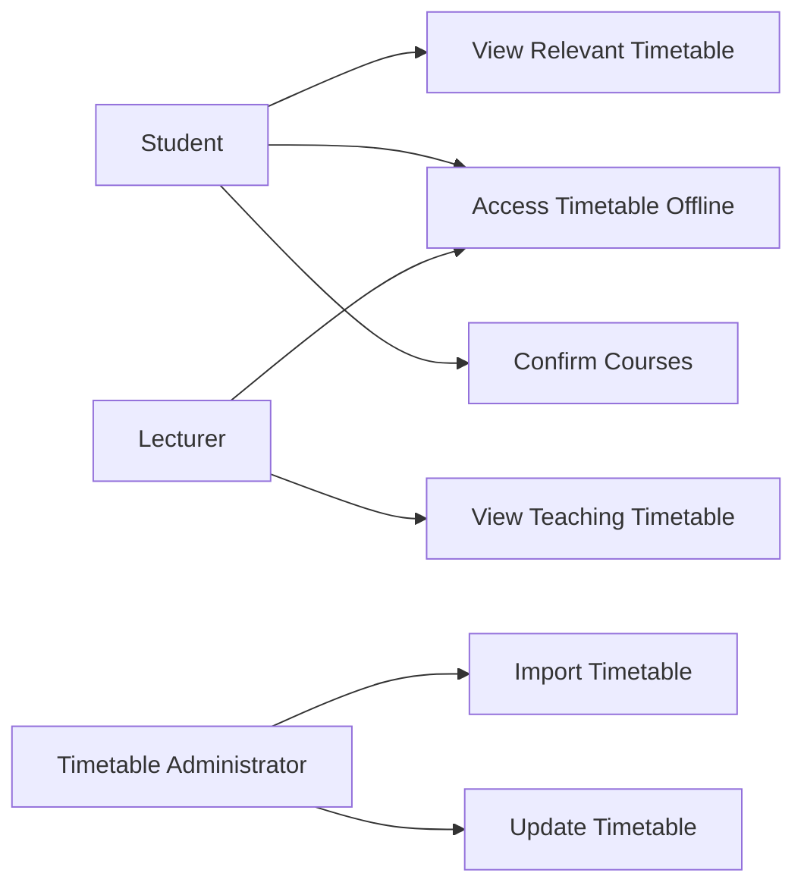
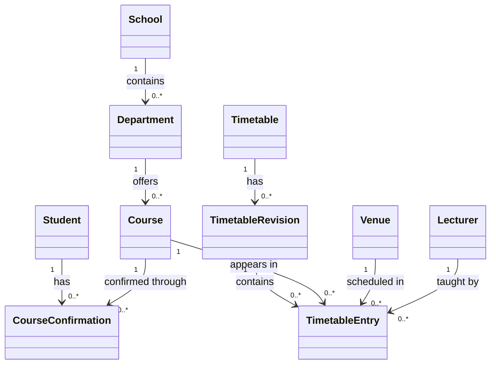
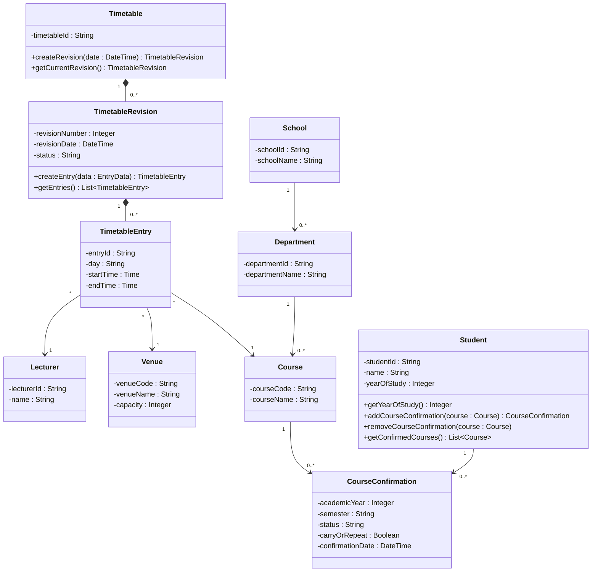
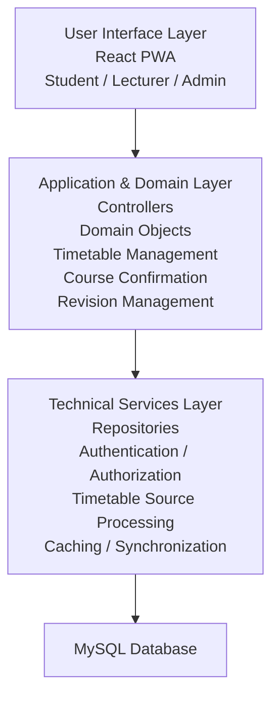
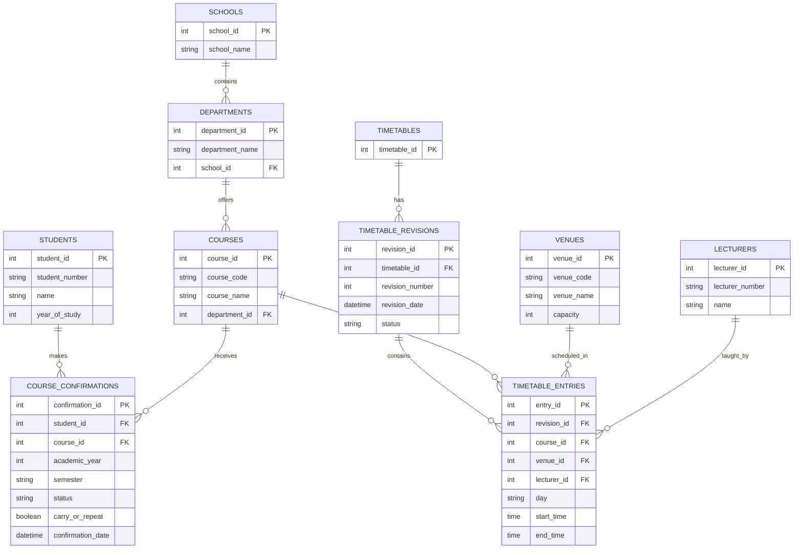

# ATLAS — Supervisor & Teammate Review Pack

**Project:** Academic Timetable Loading and Adaptive System (ATLAS)\
**Purpose:** Review and validate the requirements, analysis and design completed before substantial implementation.

---

# 1. CURRENT PROJECT POSITION

ATLAS has progressed through:

1. Approved proposal
2. Stakeholder investigation
3. Requirements findings and analysis
4. Use-case identification
5. Operation contracts
6. Domain modelling
7. GRASP responsibility assignment
8. UML interaction diagrams
9. Design Class Diagram
10. Logical architecture
11. Database schema
12. API design

**Current next step:** Authentication & RBAC design, followed by implementation.

The project is being developed iteratively. Therefore, this review is intended to validate the current design before implementation makes these decisions more expensive to change.

---

# 2. IMPORTANT PROJECT BOUNDARY

ATLAS is currently designed as a system that **consumes an already-generated institutional timetable** rather than generating the timetable itself.

Conceptually:

```text
Existing University Timetable Process
                ↓
       Already-generated timetable
                ↓
              ATLAS
                ↓
       ┌────────┴────────┐
       ↓                 ↓
   Students          Lecturers
```

ATLAS does NOT currently attempt to:

- generate the university timetable;
- optimize venue allocation;
- replace the institutional timetable-generation process;
- solve university-wide scheduling conflicts;
- provide a native mobile application.

The approved proposal explicitly excludes automatic timetable generation and AI-based scheduling optimization. It also specifies React/PWA, Node.js/Express, MySQL, JWT and RBAC as the proposed technology/design direction.

---

# 3. IMPORTANT FINDINGS FROM INVESTIGATION

## 3.1 Timetable input

The approved proposal originally specified CSV timetable input.

Stakeholder investigation subsequently indicated that the timetable currently reaches the department through the HOD as a PDF.

Therefore, this is being treated as a **refined requirement**, not ignored.

The design introduces:

`TimetableSourceProcessor`

Its purpose is to isolate timetable-source processing from the rest of the system.

Conceptually:

```text
Timetable Source
      ↓
TimetableSourceProcessor
      ↓
Structured Timetable Data
      ↓
ATLAS
```

This allows the implementation to adapt if the source format changes.

---

# 4. CURRENT POC SCOPE

The current proof of concept is focused on the Department of Computing and Informatics.

The internal model is nevertheless designed so that it is not permanently hard-coded to Computer Science.

Conceptually:

```text
School
  │
  └── Department
          │
          └── Course
```

If ATLAS is later adopted more broadly, additional departments/schools can be represented.

---

# 5. STUDENT COURSE-CONFIRMATION WORKFLOW

This is one of the core ATLAS workflows.

A student enters/has an academic year or year of study associated with their account.

ATLAS presents suggested courses for that year.

The student:

1. reviews the suggested courses;
2. removes courses they are not taking;
3. searches for courses they are carrying/repeating;
4. adds those courses;
5. confirms the final selection.

The confirmed courses are then used to determine the student's relevant timetable.

```text
Academic Year / Year of Study
            ↓
     Suggested Courses
            ↓
      Student Reviews
        ↙          ↘
 Remove courses   Search/add
 not being taken  carry/repeat
        ↘          ↙
       Final Selection
             ↓
      Course Confirmation
             ↓
       Relevant Timetable
```

The current POC does **not** directly integrate with the university Student Information System or official registration/enrolment system.

Future integration may be possible if ATLAS is adopted institutionally.

---

# 6. CURRENT USE CASE MODEL

## Actors

- Student
- Lecturer
- Timetable Administrator

## Core use cases

- UC-01 View Relevant Timetable
- UC-02 Access Timetable Offline
- UC-03 View Teaching Timetable
- UC-04 Import Timetable
- UC-05 Update Timetable
- UC-07 Confirm Courses

---

# 7. USE-CASE DIAGRAM



---

# 8. ARCHITECTURALLY IMPORTANT WORKFLOWS

The following workflows have been designed in detail:

### Import timetable

```text
Administrator
      ↓
TimetableImportController
      ↓
TimetableSourceProcessor
      ↓
Timetable
      ↓
TimetableRevision
      ↓
TimetableEntry
      ↓
TimetableRepository
      ↓
Database
```

### Update timetable

```text
Administrator
      ↓
TimetableUpdateController
      ↓
TimetableSourceProcessor
      ↓
Timetable
      ↓
New TimetableRevision
      ↓
TimetableEntry
      ↓
TimetableRepository
      ↓
Database
```

### Student timetable

```text
Student
   ↓
RelevantTimetableController
   ↓
Student's confirmed courses
   ↓
TimetableRepository
   ↓
Current timetable entries
   ↓
Relevant timetable
```

### Course confirmation

```text
Student
   ↓
CourseConfirmationController
   ↓
Suggested courses
   ↓
Student modifies selection
   ↓
CourseConfirmation
   ↓
Database
```

### Offline timetable

```text
Student/Lecturer
      ↓
TimetableAccessController
      ↓
TimetableCache
      ↓
Cached timetable
```

---

# 9. DOMAIN MODEL

The current conceptual domain contains:

- School
- Department
- Course
- Student
- Lecturer
- Venue
- Timetable
- Timetable Revision
- Timetable Entry
- Course Confirmation

Relationships:



### Important design decision

`CourseConfirmation` is being used as an association class between Student and Course because the relationship itself carries information such as:

- academic year;
- semester;
- confirmation status;
- carry/repeat status;
- confirmation date.

---

# 10. GRASP RESPONSIBILITY DESIGN

The design uses GRASP to decide which objects should be responsible for which work.

Key decisions:

| Class                        | Responsibility                          |
| ---------------------------- | --------------------------------------- |
| Student                      | Maintain confirmed courses              |
| Timetable                    | Manage revisions                        |
| TimetableRevision            | Manage timetable entries                |
| TimetableImportController    | Coordinate import                       |
| TimetableUpdateController    | Coordinate update                       |
| RelevantTimetableController  | Coordinate student timetable retrieval  |
| TeachingTimetableController  | Coordinate lecturer timetable retrieval |
| CourseConfirmationController | Coordinate course confirmation          |
| TimetableSourceProcessor     | Process timetable source                |
| TimetableRepository          | Persist/retrieve timetable data         |
| CourseRepository             | Retrieve course information             |
| TimetableCache               | Manage local timetable cache            |

Important GRASP reasoning:

- **Controller:** use-case controllers coordinate system operations.
- **Information Expert:** objects handle responsibilities for information they possess.
- **Creator:** Timetable creates revisions; revisions create entries; Student maintains course confirmations.
- **Pure Fabrication:** repositories, source processor and cache provide technical/supporting responsibilities.
- **Protected Variations:** timetable source processing and technical boundaries are isolated so changes do not spread through the system.
- **Low Coupling:** domain objects do not directly depend on MySQL or PDF-processing technology.
- **High Cohesion:** each component has a focused responsibility.

---

# 11. DESIGN CLASS DIAGRAM

## Domain classes



**Note:** Composition between Timetable → Revision and Revision → Entry is currently a design choice and should be confirmed during review.

---

# 12. CONTROLLER + SUPPORTING CLASSES

```mermaid
classDiagram

class TimetableImportController {
  -sourceProcessor : TimetableSourceProcessor
  -timetableRepository : TimetableRepository
  +importTimetable(source : Source) ImportResult
}

class TimetableUpdateController {
  -sourceProcessor : TimetableSourceProcessor
  -timetableRepository : TimetableRepository
  +updateTimetable(source : Source) UpdateResult
}

class RelevantTimetableController {
  -timetableRepository : TimetableRepository
  +requestRelevantTimetable() List~TimetableEntry~
}

class TeachingTimetableController {
  -timetableRepository : TimetableRepository
  +requestTeachingTimetable() List~TimetableEntry~
}

class CourseConfirmationController {
  -courseRepository : CourseRepository
  +getSuggestedCourses(yearOfStudy : Integer) List~Course~
  +searchCourse(query : String) List~Course~
  +confirmCourses(selections : List~Course~)
}

class TimetableAccessController {
  -timetableCache : TimetableCache
  -timetableRepository : TimetableRepository
  +requestTimetable() List~TimetableEntry~
}

class TimetableRepository {
  +save(timetable : Timetable)
  +findCurrentTimetable() Timetable
  +findCurrentEntries(courses : List~Course~) List~TimetableEntry~
  +findCurrentTeachingEntries(lecturer : Lecturer) List~TimetableEntry~
}

class CourseRepository {
  +findSuggestedCourses(yearOfStudy : Integer) List~Course~
  +searchCourse(query : String) List~Course~
}

class TimetableSourceProcessor {
  +process(source : Source) ExtractedTimetableData
}

class TimetableCache {
  +getCachedTimetable() TimetableData
  +saveTimetable(data, revision)
  +getCachedRevision() Integer
}

TimetableImportController --> TimetableSourceProcessor
TimetableImportController --> TimetableRepository

TimetableUpdateController --> TimetableSourceProcessor
TimetableUpdateController --> TimetableRepository

RelevantTimetableController --> TimetableRepository
TeachingTimetableController --> TimetableRepository

CourseConfirmationController --> CourseRepository

TimetableAccessController --> TimetableCache
TimetableAccessController --> TimetableRepository
```



---

# 13. LOGICAL ARCHITECTURE

The proposed architecture separates the user interface, application/domain logic and technical services.

Larman describes logical architecture as the large-scale organization of software classes into layers/packages, with higher layers generally using services from lower layers.



The approved proposal specifies a React PWA, Node.js/Express REST API and MySQL architecture.

---

# 14. PROPOSED PROJECT STRUCTURE

```text
ATLAS/
│
├── client/
│   └── src/
│       ├── components/
│       ├── pages/
│       ├── services/
│       ├── hooks/
│       ├── offline/
│       └── App.jsx
│
└── server/
    └── src/
        ├── controllers/
        ├── domain/
        ├── repositories/
        ├── services/
        ├── routes/
        ├── middleware/
        ├── database/
        └── app.js
```

The intention is to keep the UI independent from database implementation and to isolate technical services behind appropriate boundaries.

---

# 15. CURRENT DATABASE DESIGN



---

# 16. CURRENT API DESIGN

```text
POST /api/timetables/import
POST /api/timetables/update

GET  /api/student/courses/suggested
GET  /api/courses/search
POST /api/student/courses/confirm

GET  /api/student/timetable
GET  /api/lecturer/timetable
```

These are currently **design-level API contracts**, not immutable implementation decisions.

---

# 17. DECISIONS THAT NEED REVIEW

The supervisor and teammate should specifically review:

### A. System boundary

Is ATLAS correctly scoped as a timetable ingestion, management and distribution system rather than a timetable-generation system?

### B. Current POC scope

Is Department of Computing and Informatics an acceptable proof-of-concept boundary?

### C. Timetable input

Should the current implementation process the PDF actually supplied to the department, rather than assuming CSV?

### D. Student course confirmation

Is the proposed:

```text
Suggested Courses
       ↓
Student Verification
       ↓
Remove/Add Courses
       ↓
Final Confirmation
```

workflow correct?

### E. CourseConfirmation

Should this remain an association class between Student and Course?

### F. Timetable revision

When a revised timetable is uploaded, should it:

**Option 1**

```text
Upload
  ↓
Create Revision
  ↓
Automatically become current
```

or:

**Option 2**

```text
Upload
  ↓
Create Revision
  ↓
Review
  ↓
Publish
```

The second option has not been assumed as a confirmed requirement.

### G. Lecturer relationship

The current POC assumes one lecturer per timetable entry/course session within the department.

If ATLAS expands, team teaching may require multiple lecturers.

### H. Venue ownership

Venues are not modelled as belonging exclusively to a department because university venues may be shared.

### I. Future SIS integration

Should integration with the Student Information System / official registration system remain explicitly documented as future work rather than current functionality?

### J. Authentication

Should the system use a separate `User` identity linked to Student/Lecturer profiles, with roles controlling permissions?

---

# 18. WHAT TO ASK THE SUPERVISOR

Ask these questions directly:

1. **Is the current ATLAS system boundary acceptable?**
2. **Is the current Department of Computing and Informatics POC scope acceptable?**
3. **Should the implementation use the currently supplied PDF timetable as the source format?**
4. **Is the student course-confirmation workflow correct?**
5. **Is the current domain model sufficiently representative of ATLAS?**
6. **Are the GRASP responsibility assignments reasonable?**
7. **Is the proposed layered architecture acceptable?**
8. **Is the database structure acceptable before implementation?**
9. **Should timetable upload automatically publish a revision, or should there be a separate publication step?**
10. **Are there any requirements currently included that should be removed from the POC?**
11. **Are there any important requirements missing?**
12. **Is it acceptable to proceed into implementation after these design decisions are refined?**

---

# 19. WHAT TO ASK YOUR TEAMMATE

The teammate should specifically confirm:

### Shared understanding

- Do we agree on what ATLAS does?
- Do we agree on what ATLAS does NOT do?

### Domain vocabulary

Do we both use:

- Timetable
- TimetableRevision
- TimetableEntry
- CourseConfirmation
- Course
- Venue
- Lecturer
- Student

with the same meanings?

### Backend

- Are the controllers clear?
- Are repository responsibilities clear?
- Is timetable source processing isolated correctly?

### Database

- Does the schema support the required workflows?
- Are any tables missing?
- Are any tables unnecessary?

### API

- Are request/response responsibilities clear?
- Which endpoints require Student, Lecturer or Administrator access?

### Frontend

- Are the student, lecturer and admin workflows clear?
- Is offline access understood as client-side caching?

### Implementation

Agree on:

- Git workflow
- Branching
- folder structure
- coding conventions
- frontend/backend responsibilities
- database responsibility
- integration points

---

# 20. WHAT DOES NOT NEED TO BE REVIEWED YET

Do not spend the meeting trying to finalize:

- exact React component styling;
- exact CSS;
- exact button placement;
- exact database migration syntax;
- exact Express implementation;
- exact JWT library configuration;
- deployment configuration;
- final UI colours;
- every possible future feature.

Those belong further into implementation.

The purpose of this meeting is to validate the **system requirements, boundary and major design decisions**.

---

# 21. MATERIALS TO TAKE TO THE MEETING

Bring these in this order:

### 1. One-page project summary

ATLAS purpose, scope and current findings.

### 2. Requirements summary

Confirmed, provisional and out-of-scope requirements.

### 3. Use-case diagram

Show the main actors and system functions.

### 4. Domain model

Show the major conceptual entities and relationships.

### 5. GRASP responsibility summary

Explain why major responsibilities belong to particular classes.

### 6. Key interaction diagrams

Prioritize:

- Confirm Courses
- Import Timetable
- Update Timetable
- View Relevant Timetable

### 7. Design Class Diagram

Show the software-level classes, operations and dependencies.

### 8. Logical architecture

Show React → Node/Express → technical services → MySQL.

### 9. Database/ERD

Show how the conceptual model becomes persistent data.

### 10. API contracts

Show the proposed system endpoints.

---

# 22. WHAT YOU WANT FROM THIS REVIEW

The goal is NOT:

> "Please approve every line of code."

The goal is:

> "Please validate that the requirements, system boundary and major design decisions represent the intended ATLAS system before implementation proceeds."

The outcome should be a short list:

```text
APPROVED
   ↓
No major changes
   ↓
Proceed to implementation
```

or:

```text
FEEDBACK
   ↓
Requirements changed?
   ↓
Design changed?
   ↓
Update affected artifacts
   ↓
Revalidate
   ↓
Proceed
```

This fits the iterative development direction of the project. Larman emphasizes that early programming, testing and feedback help expose changing specifications early, allowing requirements understanding to be refined.

---

# 23. AFTER THE MEETING

Bring the supervisor/teammate feedback back to the ATLAS project.

For every comment, record:

| Feedback                            | Artifact affected              | Action  |
| ----------------------------------- | ------------------------------ | ------- |
| Example: Add publication step       | UC-05, DCD, DB, API            | Revise  |
| Example: Keep department scope      | Scope                          | Confirm |
| Example: PDF is correct input       | Requirements, source processor | Confirm |
| Example: Remove adjustment requests | Scope, use cases               | Remove  |
| Example: Add another role           | RBAC, DCD, DB                  | Revise  |

Then the design becomes the **validated baseline for implementation**.

---

# 24. CURRENT PROJECT CHECKPOINT

**Completed:**

✅ Requirements investigation\
✅ Requirements analysis\
✅ Use cases\
✅ Operation contracts\
✅ Domain model\
✅ GRASP design\
✅ Interaction diagrams\
✅ Design Class Diagram\
✅ Logical architecture\
✅ Database design\
✅ API design

**Current:**

👉 Supervisor/team design review

**Next with ChatGPT:**

👉 Authentication + RBAC design

**After that:**

👉 Final schema/API refinement\
👉 Project setup\
👉 Backend implementation\
👉 Frontend implementation\
👉 Offline functionality\
👉 Testing\
👉 Evaluation\
👉 Final technical report

---

# 25. THE ONE-SENTENCE SUMMARY TO TELL THEM

> **"We have taken the approved ATLAS proposal and stakeholder findings, translated them into requirements and use cases, then used OO analysis, GRASP, UML interaction/class modelling and layered architecture to arrive at a preliminary software and database design. We would like to validate the system boundary and major design decisions before proceeding into implementation."**
